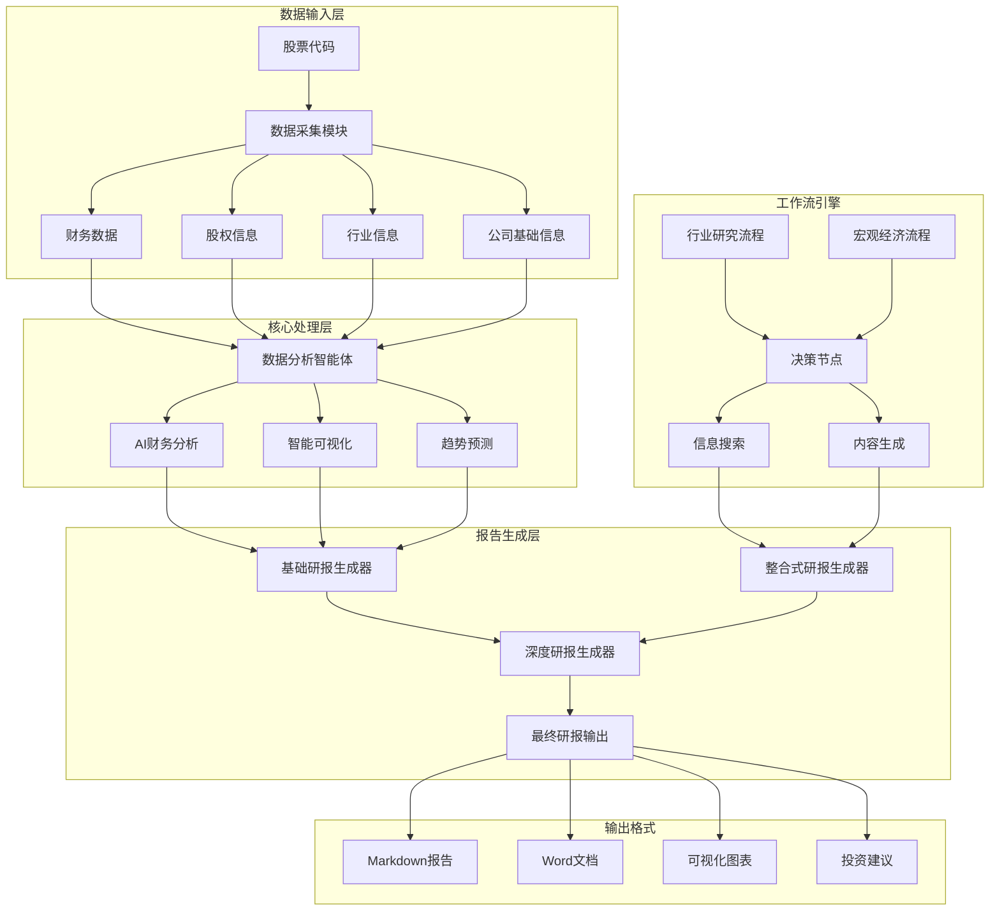

# 金融研报自动生成系统

🤖 **基于AI大模型的智能金融研报生成平台**

[](https://python.org)
[](LICENSE)
[](https://openai.com)

## 📋 项目简介

本项目是一个基于AI大模型的金融研报自动生成系统，专为金融分析师、投资者和研究机构设计。通过整合多源数据采集、智能数据分析和专业报告生成功能，实现了从数据获取到研报输出的全流程自动化。

### 🎯 核心功能

- **📊 多维度数据采集**：自动获取公司财务报表、股权结构、行业信息等多源数据
- **🤖 智能财务分析**：基于AI的财务分析、同业对比和趋势预测
- **📈 可视化图表生成**：自动生成专业的财务图表和数据可视化
- **📝 深度研报生成**：生成包含投资建议的完整金融研究报告
- **🔄 工作流引擎**：支持行业分析和宏观经济研究的自动化流程

## 🏗️ 系统架构

### 系统架构图



### 项目目录结构

```
financial_research_report/
├── 📄 核心生成器
│   ├── research_report_generator.py          # 基础研报生成器
│   ├── integrated_research_report_generator.py  # 整合式研报生成器
│   └── in_depth_research_report_generator.py    # 深度研报生成器
├── 📄 工作流引擎
│   ├── industry_workflow.py                 # 行业研究工作流
│   └── macro_workflow.py                   # 宏观经济研究工作流
├── 📁 数据分析智能体
│   └── data_analysis_agent/                # AI数据分析模块
│       ├── __init__.py
│       ├── data_analysis_agent.py          # 主分析引擎
│       ├── prompts.py                      # 提示词模板
│       ├── README.md                       # 模块文档
│       ├── config/                         # 配置文件
│       │   ├── __init__.py
│       │   └── llm_config.py              # LLM配置
│       └── utils/                          # 工具函数
│           ├── __init__.py
│           ├── code_executor.py           # 代码执行器
│           ├── create_session_dir.py      # 会话目录创建
│           ├── extract_code.py            # 代码提取
│           ├── fallback_openai_client.py  # 备用OpenAI客户端
│           ├── format_execution_result.py # 结果格式化
│           └── llm_helper.py              # LLM助手
├── 📁 数据采集工具
│   └── utils/                              # 数据获取工具集
│       ├── get_base_info.py               # 基础信息获取
│       ├── get_company_info.py            # 公司信息获取
│       ├── get_financial_statements.py    # 财务报表获取
│       ├── get_shareholder_info.py        # 股东信息获取
│       ├── get_stock_intro.py             # 股票介绍获取
│       ├── identify_competitors.py        # 竞争对手识别
│       └── search_info.py                 # 信息搜索
├── 📁 工作流框架
│   └── pocketflow/                         # 轻量级工作流引擎
│       └── __init__.py
├── 📁 数据存储
│   ├── company_info/                       # 公司基础信息
│   │   ├── 百度_HK_09888_info.txt
│   │   ├── 寒武纪_A_SH688256_info.txt
│   │   ├── 科大讯飞_A_SZ002230_info.txt
│   │   ├── 商汤科技_HK_00020_info.txt
│   │   └── 云从科技_A_SH688327_info.txt
│   ├── download_financial_statement_files/ # 财务报表数据
│   │   ├── [公司名]_balance_sheet_年度.csv  # 资产负债表
│   │   ├── [公司名]_cash_flow_statement_年度.csv # 现金流量表
│   │   └── [公司名]_income_statement_年度.csv    # 利润表
│   └── industry_info/                      # 行业信息
│       └── all_search_results.json        # 搜索结果汇总
├── 📁 输出结果
│   └── outputs/                            # 生成的报告和图表
│       └── session_[ID]/                   # 按会话分组的输出
│           ├── 经营活动现金流趋势.png
│           ├── 净利润趋势.png
│           ├── 营业收入趋势.png
│           └── 资产与权益趋势.png
├── 📄 配置文件
│   ├── requirements.txt                    # Python依赖包
│   └── LICENSE                            # 开源许可证
└── 📄 文档
    └── README.md                          # 项目说明文档
```

## 🚀 核心特性

### 1. 多源数据整合

- **财务数据**：通过akshare接口获取财务三大报表（资产负债表、利润表、现金流量表）
- **股权结构**：自动爬取同花顺等平台的股东信息
- **行业信息**：通过DuckDuckGo搜索引擎获取行业动态和市场信息
- **公司资料**：获取公司基本面信息、主营业务介绍等

### 2. 智能分析引擎

- **财务分析**：营收增长、盈利能力、偿债能力、运营效率分析
- **同业对比**：自动识别竞争对手并进行横向对比分析
- **趋势预测**：基于历史数据的未来业绩预测和估值模型
- **风险评估**：财务风险、行业风险、市场风险综合评估

### 3. 专业报告生成

- **结构化输出**：标准化的研报格式和章节结构
- **图表可视化**：专业的财务图表和数据可视化
- **投资建议**：基于分析结果的明确投资评级和建议
- **多格式支持**：支持Markdown、Word等多种输出格式

## 🛠️ 安装与配置

### 环境要求

- Python 3.8+
- OpenAI API密钥（或兼容的LLM服务）

### 安装步骤

1. **克隆项目**

```bash
git clone https://github.com/li-xiu-qi/financial_research_report
cd financial_research_report
```

2. **安装依赖**

```bash
pip install -r requirements.txt
```

3. **环境配置**
创建 `.env` 文件并配置以下变量：

```env
OPENAI_API_KEY=your_openai_api_key
OPENAI_BASE_URL=https://api.openai.com/v1
OPENAI_MODEL=gpt-4
```

## 🎮 使用指南

### 基础研报生成

```python
from research_report_generator import generate_report

# 配置目标公司
target_company = "商汤科技"
target_company_code = "00020"
target_company_market = "HK"

# 生成研报
generate_report(target_company, target_company_code, target_company_market)
```

### 整合式研报生成

```python
from integrated_research_report_generator import IntegratedResearchReportGenerator

# 创建生成器实例
generator = IntegratedResearchReportGenerator()

# 运行完整流程
generator.run_full_pipeline()
```

### 行业研究工作流

```python
from industry_workflow import IndustryResearchFlow
from pocketflow import Flow

# 创建行业研究流程
flow = Flow()
flow.add_node("industry_research", IndustryResearchFlow())

# 设置研究参数
shared_data = {
    "industry": "人工智能",
    "context": []
}

# 执行研究流程
flow.run(shared_data)
```

## 📊 数据源说明

### 主要数据来源

- **财务数据**：东方财富网财务报表接口
- **股权信息**：同花顺股东信息页面
- **公司信息**：同花顺主营业务介绍
- **行业资讯**：DuckDuckGo搜索引擎聚合信息
- **市场数据**：akshare金融数据接口

### 数据更新频率

- 财务报表：季度更新
- 股权结构：实时更新
- 行业信息：每日更新
- 市场数据：实时更新

## 🧩 模块详解

### 数据分析智能体 (Data Analysis Agent)

- **自然语言分析**：支持中文自然语言查询
- **代码自动生成**：基于需求自动生成Python分析代码
- **图表可视化**：自动生成专业图表，支持中文显示
- **报告输出**：生成Markdown和Word格式的分析报告

### 工作流引擎 (PocketFlow)

- **决策节点**：智能判断下一步分析方向
- **信息搜索**：自动搜索和整合相关信息
- **内容生成**：基于模板生成标准化报告章节

### 数据采集工具

- **财务报表获取**：支持A股、港股财务数据
- **股东信息爬取**：自动解析股权结构信息
- **竞争对手识别**：AI驱动的同业公司识别
- **行业信息搜索**：多源信息聚合和整理

## 📈 支持的分析类型

### 财务分析

- 营业收入增长趋势
- 净利润变化分析
- 现金流健康状况
- 资产负债结构

### 估值分析

- P/E、P/B等相对估值
- DCF现金流折现模型
- 行业估值对比
- 合理价值区间

### 风险分析

- 财务风险指标
- 行业周期性风险
- 市场流动性风险
- 公司治理风险

## 🎯 输出示例

生成的研报包含以下标准章节：

1. **公司概况**：基本信息、主营业务、股权结构
2. **财务分析**：三大报表分析、财务比率、趋势分析
3. **行业分析**：行业地位、竞争格局、发展趋势
4. **估值分析**：估值模型、合理价值、投资建议
5. **风险提示**：主要风险因素及应对措施

## 🔧 自定义配置

### LLM配置

支持多种大语言模型：

- OpenAI GPT系列
- 其他OpenAI兼容接口
- 本地部署模型

### 分析参数

- 历史数据回溯期间
- 同业对比范围
- 风险评估标准
- 报告详细程度

## 🤝 贡献指南

欢迎贡献代码和功能改进！

1. Fork本项目
2. 创建功能分支 (`git checkout -b feature/AmazingFeature`)
3. 提交更改 (`git commit -m 'Add some AmazingFeature'`)
4. 推送分支 (`git push origin feature/AmazingFeature`)
5. 创建Pull Request

## 📜 免责声明

- 本系统生成的研报仅供参考，不构成投资建议
- 数据来源于公开渠道，准确性以官方披露为准
- 投资有风险，决策需谨慎
- AI生成内容可能存在偏差，请结合专业判断使用

## 📞 技术支持

如有问题或建议，请通过以下方式联系：

- 提交Issue到项目仓库
- 参与项目讨论
- 查看项目文档和示例

## 📄 许可证

本项目采用 MIT 许可证 - 详见 [LICENSE](LICENSE) 文件

---

**⭐ 如果这个项目对您有帮助，请给我们一个星标！**
