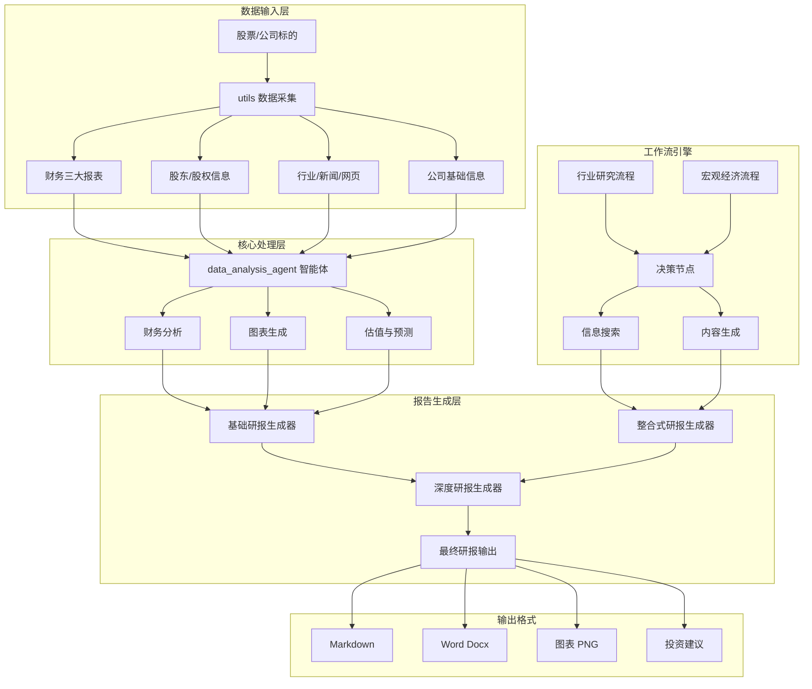

# 金融研报自动生成系统（Financial Research Report Generator）

> 基于 AI 大模型的多源数据采集、智能分析与自动研报生成平台（支持中文场景，Windows 友好）。

<p align="left">
  <a href="LICENSE"></a>
  
  
</p>

---

## 项目亮点

- 多源数据整合：公司三大报表、股权结构、公司/行业信息统一采集与组织
- 智能分析引擎：数据清洗、指标解读、同行对比、估值与预测，自动生成段落与图表
- 自动化工作流：行业研究与宏观研究工作流，支持 PocketFlow 轻量级工作流引擎
- 报告一键输出：Markdown/Word 输出，图片资源自动整理，形成可交付的研究报告
- Windows 友好：面向 Windows 环境提供一步步的安装与运行指引

---

## 目录结构

```text
financial_research_report_main/
├─ data_analysis_agent/               # AI 数据分析智能体（代码生成、执行与结果汇总）
├─ utils/                             # 数据采集工具（公司信息、股权、财报、搜索等）
├─ pocketflow/                        # 轻量级工作流引擎（本仓库内置）
├─ industry_workflow.py               # 行业研究工作流（示例入口）
├─ macro_workflow.py                  # 宏观经济研究工作流（示例入口）
├─ research_report_generator.py       # 基础研报生成脚本（线性流程示例）
├─ integrated_research_report_generator.py # 整合式“分两阶段”完整流程（推荐入口）
├─ in_depth_research_report_generator.py   # 深度研报生成（第二阶段核心逻辑）
├─ download_financial_statement_files/     # 已下载的三大报表 CSV（程序生成）
├─ company_info/                      # 公司基础信息文本（程序生成）
├─ industry_info/                     # 行业搜索结果 JSON（程序生成）
├─ outputs/                           # 输出目录（可自定义）
├─ requirements.txt                   # 依赖清单
├─ start_research.sh                  # （预留）启动脚本
└─ LICENSE
```

---

## 系统架构



---

## 安装与环境配置（Windows 优先）

### 1) 准备 Python 环境
- 推荐 Python 3.10（≥3.8 也可）
- 建议使用虚拟环境（venv/conda）：

```powershell
# 进入项目根目录
cd D:\ali_tianci\baseline_lyy\financial_research_report_main

# 创建并激活虚拟环境（PowerShell）
python -m venv .venv
.\.venv\Scripts\Activate.ps1
```

### 2) 安装依赖

```powershell
pip install -r requirements.txt
```

> 可选：若需要将 Markdown 转 Word（docx），请另外安装 pandoc（Windows 安装包见 `https://pandoc.org/installing.html`）。

### 3) 配置环境变量（.env）
在项目根目录创建 `.env` 文件：

```env
OPENAI_API_KEY=你的API密钥
OPENAI_BASE_URL=https://api.openai.com/v1
OPENAI_MODEL=gpt-4
# 可选：无网络或调试时跳过搜索
SKIP_SEARCH=false
```

---

## 快速开始

### 方式 A：整合式（推荐）
分两阶段：第一阶段采集与基础分析，第二阶段生成深度研报。

```powershell
python integrated_research_report_generator.py
```

运行完成后，输出会包含：
- 阶段一生成的 Markdown 汇总：`财务研报汇总_*.md`
- 阶段二生成的深度研报：`深度财务研报分析_*.md` 与可选的 `.docx`

### 方式 B：基础生成器（线性示例）
`research_report_generator.py` 展示了线性脚本式的完整流程：

```powershell
python research_report_generator.py
```

### 方式 C：行业/宏观研究工作流（PocketFlow 示例）

```powershell
# 行业研究
python industry_workflow.py

# 宏观研究
python macro_workflow.py
```

> 说明：当前 `industry_workflow.py` 与 `macro_workflow.py` 内置了“简化版工作流”回退逻辑。
> 如需启用真正的 PocketFlow 流程编排，请参见下文“PocketFlow 使用说明”。

---

## PocketFlow 使用说明（工作流引擎）

项目内置了轻量级工作流引擎 PocketFlow，源码位于 `pocketflow/__init__.py`，核心仅百行左右，提供：
- `Node`/`BatchNode`/`AsyncNode`：节点抽象，支持重试、批处理、异步
- `Flow`/`BatchFlow`/`AsyncFlow`：流程编排，支持条件分支与链式拼接

典型用法：

```python
from pocketflow import Node, Flow

class SearchInfo(Node):
    def prep(self, shared):
        return shared.get("search_terms", [])
    def exec(self, terms):
        return [f"result for {t}" for t in terms]
    def post(self, shared, prep_res, exec_res):
        shared.setdefault("context", []).extend(exec_res)
        return "default"

class DecisionMaker(Node):
    def prep(self, shared):
        return shared.get("context", [])
    def exec(self, context):
        return {"summary": f"{len(context)} items"}
    def post(self, shared, prep_res, exec_res):
        shared["decisions"] = exec_res
        return None

start = SearchInfo()
flow = Flow(start=start)
start >> DecisionMaker()

shared = {"search_terms": ["AI 行业", "宏观经济"]}
flow.run(shared)
```

与当前示例文件的关系：
- `industry_workflow.py`、`macro_workflow.py` 目前写法为：
  ```python
  from pocketflow import Node, Workflow  # 此处名称与内置实现不一致
  ```
  实际内置为 `Node, Flow`。因此文件中会触发“简化版”回退（兼容运行）。
- 如需启用真正 PocketFlow：
  1) 将导入改为：`from pocketflow import Node, Flow`
  2) 创建流程：
     ```python
     start = SearchInfo()
     flow = Flow(start=start)
     start >> DecisionMaker() >> ReportGenerator()
     flow.run(shared_data)
     ```

---

## 数据来源说明

- 财务数据：东方财富（港股/ A 股）公开财报接口/页面
- 股东信息：同花顺公开页面抓取
- 公司信息：同花顺主营业务介绍
- 行业资讯：公开搜索引擎（如百度），聚合权威新闻、研报与公告
- 市场数据：`akshare`/`efinance` 等开源数据接口

> 使用本项目时，请遵守目标网站的 robots 与使用条款，合理控制请求频率。

---

## 常见问题（FAQ）与故障排查

- Q1：Windows 下安装依赖报错？
  - 建议先升级 pip：`python -m pip install -U pip`
  - 若需科学网络，请提前配置好代理或使用镜像源

- Q2：无法将 Markdown 转为 Word？
  - 需要额外安装 pandoc 并将其加入 PATH；或只使用 Markdown 输出

- Q3：搜索经常失败或过慢？
  - 可在 `.env` 设定 `SKIP_SEARCH=true` 跳过网络搜索
  - 或增大重试等待时间，避免过于频繁的请求

- Q4：PocketFlow 没有生效？
  - 按照上文“PocketFlow 使用说明”将 `Workflow` 替换为 `Flow` 并使用链式拼接

- Q5：图片路径无效或导出失败？
  - 二阶段脚本会将图片统一复制到 `./images` 并修复 Markdown 引用，确保相对路径正确

---

## 开发与贡献

- 代码风格：尽量保持清晰可读、命名语义化；避免加入与功能无关的重格式化
- 提交建议：
  1. Fork 本仓库
  2. 新建特性分支：`git checkout -b feature/awesome`
  3. 提交改动：`git commit -m "feat: add awesome feature"`
  4. 推送分支并发起 PR

> 如果你在公司网络环境中无法使用 Git，可先将改动以压缩包形式共享给维护者。

---

## 许可证

本项目基于 MIT 协议开源，详见 `LICENSE` 文件。

---

## 致谢

- 感谢开源社区 `akshare`、`efinance`、`pandas`、`matplotlib`、`seaborn` 等优秀项目
- 感谢所有提出建议与贡献代码的朋友
